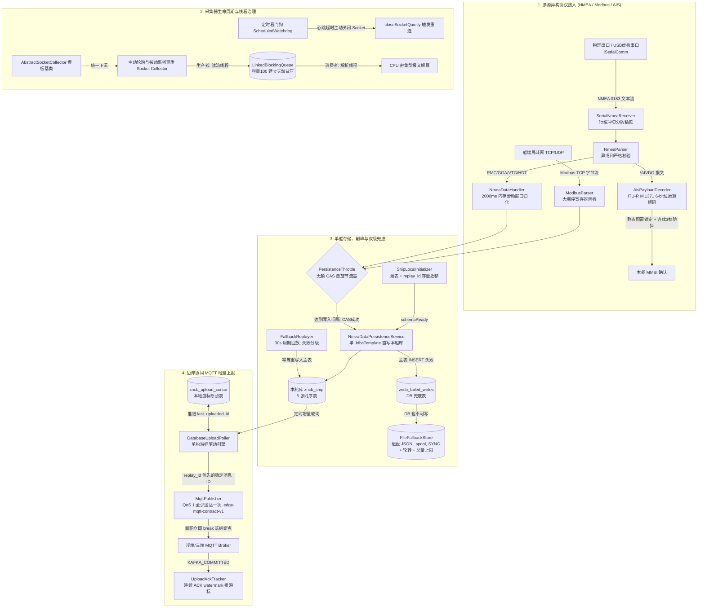

# SmartShip Edge Core (智慧船舶边缘计算核心引擎)

[](https://openjdk.org/)
[](https://spring.io/projects/spring-boot)
[](https://github.com/Thehe01/Smartship/actions/workflows/ci.yml)
[](LICENSE)

**SmartShip Edge Core** 是专为远洋与内河船舶场景打造的高可靠工业物联网（IIoT）边缘采集与上报引擎。系统聚焦于解决恶劣工况下**物理串口与以太网多源异构协议接入、采集器线程泄漏与假死自愈、单船高频写入削峰与弱网双级兜底、以及卫星信道下的轻量断点续传**等工程痛点。

> **架构定位（单船单库）**：船端只存本船数据——唯一数据源即 Spring 默认单数据源（本地本船库 `zncb_ship`），分船按 `mmsi` 切分在**岸端**完成，本仓不做任何 per-ship 路由。

---

## 🏛️ 全局系统架构



---

## 🌟 四大核心技术亮点

### 1. 船端多协议接入与 AIS 自适应身份识别
- **物理链路弹性接入**：基于 `jSerialComm` 适配船端 RS-232/422 物理串口与虚拟 USB 串口，以太网 TCP/UDP 采用 `java.net.Socket` / `DatagramSocket` 接入，采用动态行缓冲区机制解决流式非结构化数据的半包与粘包。
- **严苛的异或校验（XOR Checksum）**：对 NMEA 0183 报文实现逐字节异或和比对，遇电磁脉冲误码坚决丢弃，并在业务层将航海格式坐标（$ddmm.mmmm$）精准还原为十进制度数。
- **2000ms 内存滑动聚合**：GNSS 接收机将定位信息分散输出在 RMC（航速航向）与 GGA（海拔卫星数），系统通过分段锁与 2 秒内存滑动窗口将离散数据融合成完整的不可变业务快照。
- **AIS 6-bit Payload 解码**：基于 ITU-R M.1371 标准自主实现 6-bit ASCII armoring 逆向映射算法，从 `!AIVDO` 报文中提取 30 位 MMSI，并引入“静态配置锁定 + 连续 3 帧防抖确认”状态机，实现船舶即插即用与免配上线。

### 2. 采集器生命周期与线程治理
- **模板方法模式重构**：将主动轮询与被动监听两类 Socket 采集器的连接、超时、线程管理与优雅停机下沉至 `AbstractSocketCollector`，消除几百行冗余代码。
- **命名守护线程（Daemon ThreadFactory）**：线程统一命名为 `Collector-{devCode}-{devName}-{counter}`，生产环境打 `jstack` 实现秒级定位故障设备；标记为守护线程杜绝阻碍 JVM 正常注销。
- **看门狗自愈 TCP 半开假死**：单线程 ScheduledExecutor 维持独立看门狗，检测心跳差超时主动切断底层 Socket fd，自愈无 FIN 包的硬件断电假死连接。
- **有界队列背压机制（Backpressure）**：读流与解析线程间采用容量为 100 的 `LinkedBlockingQueue` 解耦，消费变慢时阻塞读流反压对端，避免堆内存 OOM。

### 3. 单船存储、幂等键与双级兜底
- **单船单库（无分船路由）**：`ShipLocalInitializer` 只做两件事——确保 7 张表结构存在（含存量库 `replay_id` 列 + 唯一约束的元数据校验式迁移），置位 `schemaReady` 并持久化 MMSI。迁移失败即抛，绝不带病启动；分船切分在岸端按 `mmsi` 完成。
- **全链路统一幂等键 `replay_id`**：5 张时序表 + 兜底表各带 `replay_id VARCHAR(64)` 与 `UNIQUE(replay_id)`；主链路 / DB 兜底 / 磁盘 spool / 批量 / 上传全部携带同一键。重复投递被 `DuplicateKeyException`-as-success 吸收（H2/MySQL 同路径可测），MQTT 稳定消息 ID 优先取 `replay_id`（契约 `edge-mqtt-contract-v1`，岸端 E2E 钉死）。
- **无锁 CAS 写入节流（`PersistenceThrottle`）**：针对传感器 10Hz~50Hz 的高频发射，基于 `AtomicLong` 的 CAS 自旋机制按 `MMSI:dataType` 实施最小写入间隔（默认 1 秒），快路径纳秒级短路。
- **双级兜底 + 失败分级回放**：主表写失败先进 `zncb_failed_writes`（DB 级，单行本地事务 INSERT 主表 + DELETE 兜底行原子提交），DB 也不可写才进磁盘 JSONL spool（SYNC 落盘、文件轮转、总量上限、超限删最老并计数）。`FallbackReplayer` 每 30s 先扫 DB（`id > cursor` 分页）再扫文件；**瞬时故障（连接/锁/死锁/未知异常）不计数、本轮即停下轮重试，绝不错杀正常数据；只有解析失败/未知流/确定性数据错误才记毒，超 5 次跳过保留供审计**——MySQL 长时间故障不会把合法数据熬成毒行。

### 4. 边岸协同 MQTT 增量上报与应用层 ACK
- **游标驱动轻量断点续传**：基于本地 `zncb_upload_cursor` 记录每条数据流的 `last_uploaded_id`，支持离线堆积与断网恢复后的无缝续查。
- **断网短路保护（Break-on-Failure）**：网络异常时坚决 `break` 终止批次，冻结游标在最后一个成功断点处，杜绝航迹空洞与数据丢失。
- **Application ACK（Kafka durable 确认）**：PUBACK 只记在途不推游标；岸端 Kafka `acks=all` 落定后回 `ship/{mmsi}/ack`（`{msg_id, seq, KAFKA_COMMITTED}`），游标按连续 ACK watermark 推进；乱序只记账、超时按 id 回查补发、窗口满停发等 ACK；`ack.enabled=false` 可退回 PUBACK 旧语义。详见岸端 `docs/APPLICATION_ACK.md`。

---

## 📂 工程目录结构

```text
smartship-edge-core/
├── pom.xml                                   # Spring Boot 3.3.5, Java 17；exec classifier 出可运行 jar
├── README.md                                 # 本项目技术说明
├── .github/workflows/ci.yml                 # Edge 门禁：本仓全量单测 + 跨仓协议 E2E
├── src/
│   ├── main/
│   │   ├── java/com/smartship/edge/
│   │   │   ├── EdgeCoreApplication.java      # Spring Boot 主启动类
│   │   │   ├── collect/                      # [模块一] 协议接入与归一化
│   │   │   │   ├── modbus/                   # ModbusParser, ModbusDataHandler, tcp 编解码
│   │   │   │   └── nmea/                     # parser/receiver/service: 解析、接收器、归一化
│   │   │   ├── collector/                    # [模块二] 采集器生命周期与线程治理
│   │   │   │   ├── AbstractSocketCollector.java
│   │   │   │   ├── Collectable.java
│   │   │   │   ├── CollectorFactory.java       # 生产装配唯一入口，注入 ModbusParser
│   │   │   │   ├── SocketListenCollector.java
│   │   │   │   ├── SocketPollingCollector.java
│   │   │   │   ├── model/                    # ConfigDevice, BaseInfoVO 等
│   │   │   │   └── utils/                    # ModbusUtils
│   │   │   ├── routing/                      # [模块三] 初始化、节流与持久化
│   │   │   │   ├── ShipLocalInitializer.java   # 单船建表 + replay_id 迁移 + schemaReady
│   │   │   │   ├── PersistenceThrottle.java    # 无锁 CAS 写入节流
│   │   │   │   ├── pool/                     # 异步持久化有界线程池与可观测性指标
│   │   │   │   └── service/                  # NmeaDataPersistenceService, WriteBatcher, EnginePoint
│   │   │   ├── persist/                      # [模块三] 双级兜底与回放
│   │   │   │   ├── FileFallbackStore.java      # 磁盘 JSONL spool
│   │   │   │   └── FallbackReplayer.java       # 失败分级回放器
│   │   │   ├── uploader/                     # [模块四] MQTT 增量上报与幂等指纹
│   │   │   │   ├── DatabaseUploadPoller.java   # 单船游标轮询
│   │   │   │   ├── UploadAckTracker.java       # 应用层 ACK watermark
│   │   │   │   └── mqtt/                     # MqttPublisher, MqttClientManager
│   │   │   ├── observability/                # SmartShipMetrics, 各 Binder, 积压指标
│   │   │   └── config/                       # EdgeProperties, MmsiPersistence
│   │   └── resources/
│   │       ├── application.yml               # 单数据源 + persist 回放/兜底参数（脱敏）
│   │       └── schema/
│   │           └── ship-schema.sql           # 本船库 7 表：5 时序表 + upload_cursor + failed_writes
│   └── test/
│       └── java/com/smartship/edge/          # 自动化单元测试（H2 MySQL 模式；E2E 需 Docker）
│           ├── persist/                      # FallbackReplayTest（毒行/分级/双通道同键）
│           ├── routing/                      # ShipLocalInitializerTest（迁移/幂等/约束名）
│           └── uploader/mqtt/                # MqttPublisherContractTest（契约钉死）
└── target/smartship-edge-core-1.0.0-exec.jar # 可运行交付物（plain jar 保留基名供岸端测试依赖）
```

---

## 🚀 快速上手与验证

### 1. 环境要求
- **JDK**：17
- **Maven**：3.8+
- **MySQL**：5.7 / 8.0+（生产本船库；单测用 H2 MySQL 模式，零外部依赖）
- **Docker**（可选）：仅跨仓 E2E（Mosquitto/Kafka/MySQL Testcontainers）需要

### 2. 执行核心单元测试
```bash
mvn clean test
```
**测试覆盖范围**：
- `AisPayloadDecoderTest`: 验证 6-bit 字符逆向数学映射与 MMSI 提取
- `NmeaChecksumTest`: 验证异或和拦截电磁误码、度分转十进制度数精度
- `PersistenceThrottleTest`: 模拟 50 线程突发并发竞争，验证 CAS 原子放行唯一性
- `MqttPublisherContractTest`: 冻结 `edge-mqtt-contract-v1`，`replay_id` 优先稳定 ID
- `ShipLocalInitializerTest`: 存量迁移、重复执行幂等、约束名对齐、脏数据如实失败
- `FallbackReplayTest`: 毒行分页、瞬时/确定性失败分级、DB+spool 同键单行

### 3. 本地启动运行
```bash
mvn spring-boot:run
# 或交付可运行 jar：
java -jar target/smartship-edge-core-1.0.0-exec.jar
```

### 4. 关键配置（`application.yml`）
```yaml
spring.datasource.url: jdbc:mysql://localhost:3306/zncb_ship  # 单船单库
smartship.edge.persist:
  fallback-dir: "data/failed-writes"  # 磁盘 spool 目录
  fallback-max-mb: 100                # 总量上限，超限删最老并计数
  replay-enabled: true
  replay-interval-ms: 30000           # 回放周期
  replay-batch-size: 200              # 单轮预算
```

---

## 🔒 门禁与跨仓验证

- **本仓 CI**（`.github/workflows/ci.yml`，push/PR 到 main 自动触发）：
  1. `edge-tests`——`mvn clean test` 全量单测，零失败/零错误；
  2. `cross-repo-e2e`——用**本次提交**的 Edge 构建去跑岸端 `EdgeProtocolE2ETest`（真实 Mosquitto→Shore→Kafka→MySQL→ACK→游标链路），保证 `replay_id` / 兜底 / 迁移改动合入即被验证。
- **岸端 CI**只在 Shore push/PR 时触发且用 Edge main，两边互补，不存在“Edge 改了、E2E 没跑”的窗口。

---

## 📄 开源许可证

本项目遵循 [Apache 2.0 License](LICENSE)。
