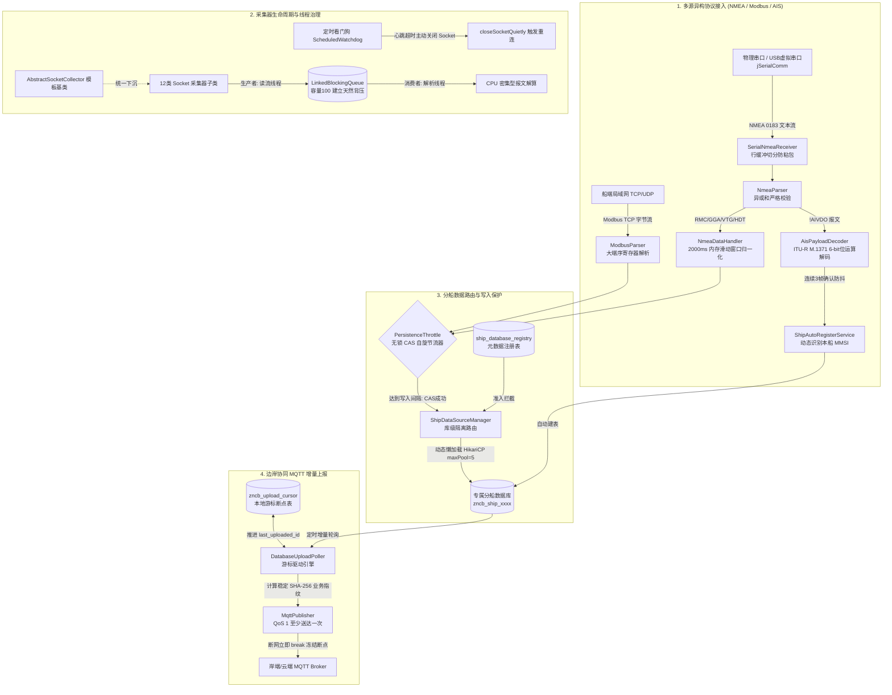

# SmartShip Edge Core (智慧船舶边缘计算核心引擎)

[](https://openjdk.org/)
[](https://spring.io/projects/spring-boot)
[]()
[](LICENSE)

**SmartShip Edge Core** 是专为远洋与内河船舶场景打造的高可靠工业物联网（IIoT）边缘采集与上报引擎。系统聚焦于解决恶劣工况下**物理串口与以太网多源异构协议接入、采集器线程泄漏与假死自愈、多船数据库级隔离与高频写入削峰、以及弱网卫星信道下的轻量断点续传**等工程痛点。

---

## 🏛️ 全局系统架构



---

## 🌟 四大核心技术亮点

### 1. 船端多协议接入与 AIS 自适应身份识别
- **物理链路弹性接入**：基于 `jSerialComm` 与 Java NIO 适配船端 RS-232/422 物理串口、虚拟 USB 串口及以太网 TCP/UDP，采用动态行缓冲区机制解决流式非结构化数据的半包与粘包。
- **严苛的异或校验（XOR Checksum）**：对 NMEA 0183 报文实现逐字节异或和比对，遇电磁脉冲误码坚决丢弃，并在业务层将航海格式坐标（$ddmm.mmmm$）精准还原为十进制度数。
- **2000ms 内存滑动聚合**：GNSS 接收机将定位信息分散输出在 RMC（航速航向）与 GGA（海拔卫星数），系统通过分段锁与 2 秒内存滑动窗口将离散数据融合成完整的不可变业务快照。
- **AIS 6-bit Payload 解码**：基于 ITU-R M.1371 标准自主实现 6-bit ASCII armoring 逆向映射算法，从 `!AIVDO` 报文中提取 30 位 MMSI，并引入“静态配置锁定 + 连续 3 帧防抖确认”状态机，实现船舶即插即用与免配上线。

### 2. 采集器生命周期与线程治理
- **模板方法模式重构**：将 12 类异构设备采集器的连接、超时、线程管理与优雅停机下沉至 `AbstractSocketCollector`，消除几百行冗余代码。
- **命名守护线程（Daemon ThreadFactory）**：线程统一命名为 `Collector-{devCode}-{devName}-{counter}`，生产环境打 `jstack` 实现秒级定位故障设备；标记为守护线程杜绝阻碍 JVM 正常注销。
- **看门狗自愈 TCP 半开假死**：单线程 ScheduledExecutor 维持独立看门狗，检测心跳差超时主动切断底层 Socket fd，自愈无 FIN 包的硬件断电假死连接。
- **有界队列背压机制（Backpressure）**：读流与解析线程间采用容量为 100 的 `LinkedBlockingQueue` 解耦，消费变慢时阻塞读流反压对端，避免堆内存 OOM。

### 3. 分船数据路由与写入保护
- **库级数据隔离（Schema-Level Isolation）**：由 `ship_database_registry` 元数据驱动，通过 `ConcurrentHashMap` 配合 HikariCP 实现分船连接池的线程安全懒加载，将各船数据写入专属独立 Schema，杜绝跨船串库。
- **严格准入拦截**：对未在注册表中配置或处于禁用状态（`enabled=0`）的 MMSI 实施入口级短路拦截抛出 404，防止非法数据污染。
- **无锁 CAS 写入节流（`PersistenceThrottle`）**：针对传感器 10Hz~50Hz 的高频发射，基于 `AtomicLong` 的 CAS 自旋机制按 `MMSI:dataType` 实施最小写入间隔（默认 1 秒），快路径纳秒级短路，削减 80% 以上磁盘 I/O 写入。
- **连接数严格配额**：每个分船连接池 `maximumPoolSize` 限制为 5，严格契合边缘工控机紧缺的并发资源。

### 4. 边岸协同 MQTT 增量上报与幂等指纹
- **游标驱动轻量断点续传**：基于本地 `zncb_upload_cursor` 记录每条数据流的 `last_uploaded_id` 与 `last_uploaded_time`，支持离线堆积与断网恢复后的无缝续查。
- **断网短路保护（Break-on-Failure）**：网络异常时坚决 `break` 终止批次，冻结游标在最后一个成功断点处，杜绝航迹空洞与数据丢失。
- **确定性稳定 Message ID（SHA-256）**：提取记录的自然主键与时间戳计算 SHA-256 散列，生成恒定的 64 位指纹，为岸端通过 Redis 或时序库唯一键实现业务级幂等去重提供基础。

---

## 📂 工程目录结构

```text
smartship-edge-core/
├── pom.xml                                   # 纯净 Maven 依赖 (Spring Boot 3.3.5, Java 17/21)
├── README.md                                 # 本项目技术说明
├── docs/
│   └── smartship_interview_guide.md          # 详细的设计技术与面试全景答辩手册
├── src/
│   ├── main/
│   │   ├── java/com/smartship/edge/
│   │   │   ├── EdgeCoreApplication.java      # Spring Boot 主启动类
│   │   │   ├── collect/                      # [模块一] 协议接入与归一化
│   │   │   │   ├── modbus/                   # ModbusParser, ModbusDataHandler
│   │   │   │   └── nmea/                     # NmeaParser, AisPayloadDecoder, Receivers, Handler
│   │   │   ├── collector/                    # [模块二] 采集器生命周期与线程治理
│   │   │   │   ├── AbstractSocketCollector.java
│   │   │   │   ├── Collectable.java
│   │   │   │   ├── SocketListenCollector.java
│   │   │   │   ├── SocketPollingCollector.java
│   │   │   │   └── model/                    # ConfigDevice, BaseInfoVO 等
│   │   │   ├── routing/                      # [模块三] 分船数据路由与 CAS 写入节流
│   │   │   │   ├── ShipDataSourceManager.java
│   │   │   │   ├── PersistenceThrottle.java
│   │   │   │   ├── ShipAutoRegisterService.java
│   │   │   │   └── service/                  # NmeaDataPersistenceService
│   │   │   ├── uploader/                     # [模块四] MQTT 增量上报与幂等指纹
│   │   │   │   ├── DatabaseUploadPoller.java
│   │   │   │   └── mqtt/                     # MqttPublisher, MqttClientManager
│   │   │   └── config/                       # EdgeProperties, MmsiPersistence
│   │   └── resources/
│   │       ├── application.yml               # 脱敏配置文件
│   │       └── schema/
│   │           └── serialdata-schema.sql     # 船舶表结构自动初始化 DDL
│   └── test/
│       └── java/com/smartship/edge/          # 自动化核心单元测试
│           ├── AisPayloadDecoderTest.java    # AIS 6-bit 算法测试
│           ├── NmeaChecksumTest.java         # NMEA 校验与经纬度转换测试
│           ├── PersistenceThrottleTest.java  # 无锁 CAS 50线程并发压测
│           └── MqttStableIdTest.java         # SHA-256 幂等散列稳定性测试
```

---

## 🚀 快速上手与验证

### 1. 环境要求
- **JDK**：17 或 21
- **Maven**：3.8+
- **MySQL**：5.7 / 8.0+（单机即可测试分船路由）

### 2. 执行核心单元测试
工程内置了全套高并发与算法单元测试，可直接在无外部依赖下执行：
```bash
mvn clean test
```
**测试覆盖范围**：
- `AisPayloadDecoderTest`: 验证 6-bit 字符逆向数学映射与 MMSI 提取
- `NmeaChecksumTest`: 验证异或和拦截电磁误码、度分转十进制度数精度
- `PersistenceThrottleTest`: 模拟 50 线程突发并发竞争，验证 CAS 原子放行唯一性
- `MqttStableIdTest`: 验证弱网重传场景下 SHA-256 消息指纹的一致性与幂等性

### 3. 本地启动运行
```bash
mvn spring-boot:run
```

---

## 📖 技术演进与设计白皮书

关于本工程的**架构权衡、与业界标准 Transactional Outbox 的客观差异、线上 jstack 故障排查手册、以及求职答辩高频问答**，请参阅：
👉 [docs/smartship_interview_guide.md](docs/smartship_interview_guide.md)

---

## 📄 开源许可证

本项目遵循 [Apache 2.0 License](LICENSE)。
